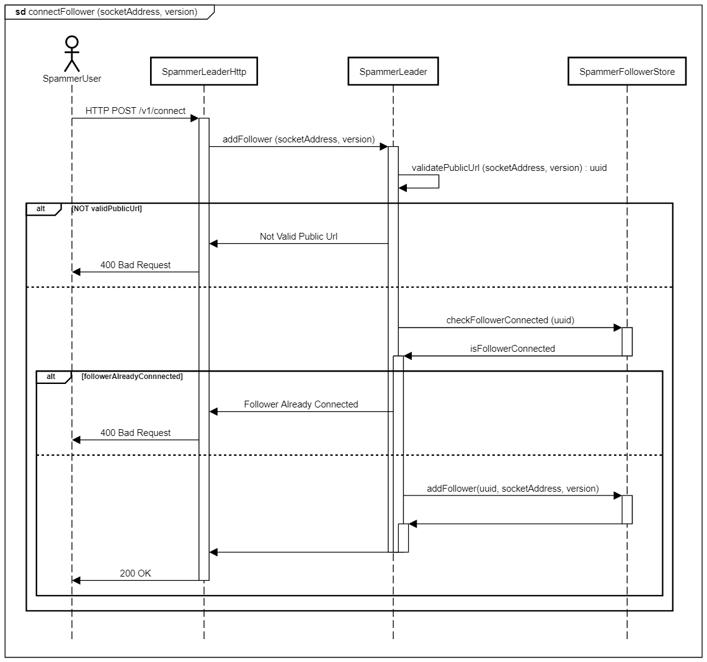

# SpammerV2

[](<LINK>)

## Running

`npm start`

## Testing

### Unit Tests

`npm test`

#### Coverage

Coverage results are generated by default in the folder `coverage`.
The following thresholds must be met in order for the command to pass:

```json
"globals": {
    "branches": 80,
    "functions": 80,
    "lines": 80,
    "statements": 80
}
```

The thresholds can be configured in `package.json`.

### Mutation Tests

`npm run mutation`

#### Report

The mutation report is generated in `reports/mutation/html`.

#### Mutation Coverage

Mutation test coverage thresholds are configuered in `stryker.conf.js`:

```text
thresholds: {
    high: 80,
    low: 60,
    break: 50,
}
```

## Static Analysis

`npm run lint`: Run ESLint against all JS code, including the Prettier plugin.

`npx prettier -c **`: Ensures that all files (not just JS files) are correctly formatted. To fix formatting, you can run `npx prettier --write **`.

## Sequence Diagrams

### Connect to Server



### Start Performance Test


### Determine Spammer Clients


## API

### Client


